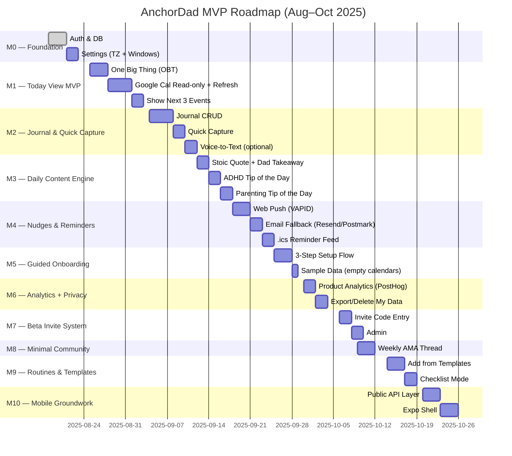

# AnchorDad — Public Roadmap

> Status legend: 🟢 planned · 🟡 in progress · 🔵 in review · ✅ done

## Milestones (Epics)
- M0 — Foundation
- M1 — Today View MVP
- M2 — Journal & Quick Capture
- M3 — Daily Content Engine
- M4 — Nudges & Reminders
- M5 — Guided Onboarding
- M6 — Analytics + Privacy Tools
- M7 — Beta Invite System
- M8 — Minimal Community
- M9 — Routines & Templates
- M10 — Mobile Groundwork

## Schedule (Mermaid Gantt)

## Following along
- Project board: “AnchorDad — MVP Build”
- Issues are tagged by milestone and labels (today-view, calendar, journal, etc.)
